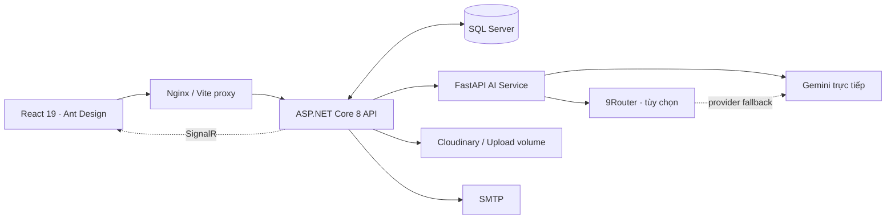
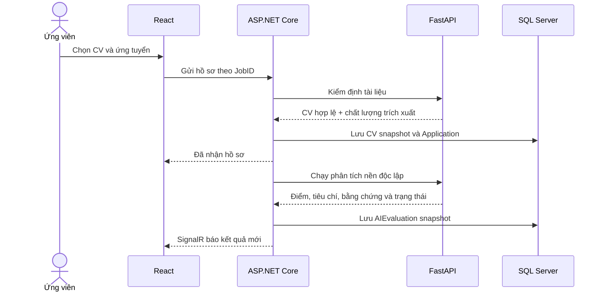
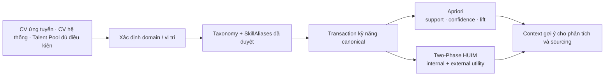

<div align="center">

# RecruitInsightAI

**Nền tảng tuyển dụng đa vai trò, kết hợp tiêu chí có cấu trúc, phân tích CV có bằng chứng và khai phá kỹ năng.**

[](./ai-recruitment-frontend)
[](./RecruitmentBackend)
[](./Python)
[](./RecruitmentBackend/RecruitmentBackend/Data)
[](./deploy/vps)

[Website](https://recruitinsightai.com) · [Bản đồ source AI](./Python/SOURCE_FLOW_GUIDE.md) · [Dữ liệu kiểm thử](./tools/selenium_e2e/README.md) · [Nhật ký dự án](./WORK_LOG.md)

</div>

---

## Tổng quan

RecruitInsightAI mô phỏng trọn vẹn một quy trình tuyển dụng: đăng tin, duyệt tin, tiếp nhận hồ sơ, phân tích CV, quản lý chiến dịch, tìm kiếm ứng viên, xây dựng Talent Pool, lên lịch phỏng vấn và theo dõi báo cáo theo thời gian thực.

Điểm khác biệt của dự án nằm ở cách AI được đặt trong một luồng có thể kiểm tra:

- Điểm phù hợp được tính theo **tiêu chí và trọng số do HR cấu hình cho từng tin**, không phải một điểm năng lực chung của ứng viên.
- Mọi nhận xét quan trọng phải được đối chiếu với đoạn trích trong CV; nội dung chưa đối chiếu được mang nhãn riêng và không được dùng để kết luận gian dối.
- OCR, AI chuyên sâu và fallback có trạng thái độc lập: `thành công`, `phân tích một phần`, `không đủ dữ liệu` hoặc `lỗi dịch vụ`.
- Apriori và Two-Phase HUIM chỉ học từ kỹ năng đã chuẩn hóa theo taxonomy, có domain và nguồn dữ liệu đủ điều kiện.
- Kết quả AI hỗ trợ sàng lọc và chuẩn bị phỏng vấn; hệ thống **không xác minh lời khai là thật hay giả** và không thay thế quyết định của con người.

> Đây là sản phẩm phục vụ khóa luận và kiểm thử học thuật. Các bộ dữ liệu sinh tự động được ghi nhận là dữ liệu tổng hợp, không được trình bày như độ chính xác trên thị trường tuyển dụng thật.

## Chức năng theo vai trò

| Vai trò | Khả năng chính |
|---|---|
| Khách | Xem danh sách và chi tiết việc làm, tìm kiếm/lọc tin, đăng ký và đăng nhập. |
| Ứng viên | Quản lý hồ sơ và nhiều CV, tạo CV, lưu việc làm, ứng tuyển, theo dõi trạng thái, xem báo cáo năng lực, STAR, ngôn từ, red flag và lộ trình ôn tập; chủ động cấp quyền để HR tìm thấy/liên hệ/xem CV. |
| HR | Tạo, chỉnh sửa và đăng lại tin; cấu hình tiêu chí; quản lý chiến dịch và hồ sơ; so sánh ứng viên; cập nhật trạng thái, gửi email, lên lịch phỏng vấn; tìm ứng viên, lưu Talent Pool, ghi chú và phân loại sourcing. |
| Admin | Duyệt/từ chối tin, quản lý tài khoản và phân quyền, chi nhánh, lĩnh vực, vị trí, cấp bậc, taxonomy kỹ năng, cấu hình hệ thống, nhật ký và dashboard tổng hợp. |

## Kiến trúc hệ thống



| Lớp | Công nghệ | Trách nhiệm |
|---|---|---|
| Giao diện | React 19, TypeScript, Vite, Ant Design, SignalR | Portal công khai, trang Ứng viên, HR, Admin, realtime và responsive. |
| Nghiệp vụ | ASP.NET Core 8, EF Core, JWT, SignalR | Phân quyền, workflow tuyển dụng, validation, lưu snapshot CV/AI, email, notification và audit. |
| AI/NLP | FastAPI, spaCy, scikit-learn, Gemini | Đọc tài liệu, trích xuất, chuẩn hóa kỹ năng, scoring, timeline, STAR, ngôn từ, red flag và gợi ý. |
| Khai phá | Apriori, Two-Phase HUIM | Tìm tổ hợp kỹ năng thường đi cùng và tổ hợp có utility cao theo domain. |
| Dữ liệu | SQL Server, SQLite 9Router, volume runtime | Dữ liệu nghiệp vụ, taxonomy/alias, trạng thái mining và provider dự phòng. |
| Vận hành | Docker Compose, Nginx, Let's Encrypt | Build, healthcheck, HTTPS, volume bền vững và rollback image. |

## Luồng nộp và phân tích CV



Mỗi lần ứng tuyển giữ snapshot CV riêng. Ứng viên có thể tiếp tục nộp công việc khác trong khi hồ sơ trước đang được phân tích; kết quả nền không khóa toàn bộ phiên người dùng.

### 1. Đọc tài liệu nhiều lớp

```text
PDF có text  → PyPDF2 + pdfplumber plain/layout → đối chiếu nguồn đọc
PDF scan     → Poppler/PDFium → Tesseract vie+eng nhiều PSM → Vision khi cần
Ảnh          → Pillow → Tesseract vie+eng nhiều PSM → Vision khi cần
DOCX         → python-docx → đoạn văn + bảng
Kết quả      → quality + agreement + analysis_safe
```

Nếu nguồn đọc mâu thuẫn hoặc độ tin cậy không đủ, hệ thống dừng các bước phân tích phụ thuộc văn bản thay vì biến lỗi OCR thành lỗi của ứng viên.

### 2. Chuẩn hóa và chấm tiêu chí

1. Trích xuất thông tin, kinh nghiệm, dự án và kỹ năng từ CV/JD.
2. Quy alias về kỹ năng canonical trong `Skills` và `SkillAliases` của SQL Server.
3. Chuẩn hóa timeline, loại thời gian chồng lặp và tính kinh nghiệm tổng/riêng theo kỹ năng.
4. Đánh giá từng tiêu chí HR cấu hình, áp dụng trọng số và lưu đoạn trích hỗ trợ.
5. Sinh phần giải thích chuyên sâu, STAR, ngôn từ, nội dung cần xác minh và lộ trình ôn tập.
6. Hậu kiểm output AI; nội dung không truy hồi được từ CV không được giữ như bằng chứng xác nhận.

`Fit score` phản ánh mức đáp ứng của hồ sơ đối với **một tin cụ thể**. Một ứng viên nhiều năm kinh nghiệm vẫn có thể có điểm thấp nếu không đáp ứng các tiêu chí bắt buộc hoặc trọng số của tin đó.

### 3. Chính sách bằng chứng và red flag

- `Mức độ đầy đủ của bằng chứng` là tỷ lệ tiêu chí có đoạn trích hỗ trợ; không phải xác suất CV đúng sự thật.
- Red flag chỉ dành cho dấu hiệu bất thường như nhồi từ khóa, mâu thuẫn nội bộ, thông tin bằng cấp/liên hệ/timeline không nhất quán.
- Thiếu số liệu, mô tả chung, thiếu kỹ năng JD hoặc gap nghề nghiệp thông thường nằm ở phần cần cải thiện, không bị gọi là red flag.
- Quan sát chưa có đoạn trích được tách thành dấu hiệu cần xác minh và không tham gia chấm điểm.
- Hệ thống không tính phần trăm “CV do AI tạo”.

### 4. Trạng thái AI và fallback

```text
9Router (nếu bật)
    → Gemini trực tiếp
        → fallback cục bộ có nhãn
```

9Router có ngân sách chờ tổng và circuit breaker. Khi provider free hết quota hoặc timeout, request kế tiếp tạm bỏ qua router để không làm cả batch CV cùng chờ. Fallback cục bộ vẫn cung cấp thông tin kiểm tra được nhưng luôn mang trạng thái phân tích một phần, không giả là kết quả LLM hoàn chỉnh.

## Apriori, Two-Phase HUIM và vòng dữ liệu kỹ năng



- Scheduler kiểm tra dữ liệu khi backend khởi động và lúc **02:00 giờ Việt Nam**.
- Nếu fingerprint đầu vào không thay đổi hoặc dữ liệu không đủ, lần train được `skip`; kết quả tốt trước đó không bị ghi đè bằng dữ liệu rỗng/mock.
- Apriori mô tả kỹ năng thường xuất hiện cùng nhau trong tập quan sát.
- HUIM dùng utility có nguồn từ dữ liệu tuyển dụng cùng domain; kết quả không được gọi là “kỹ năng hiếm/đắt giá trên thị trường” nếu chưa có dữ liệu thị trường đại diện.
- Mining bổ sung context cho hệ thống; điểm tiêu chí của một application vẫn do tiêu chí của chính Job quyết định.

## Cấu trúc repository

```text
KhoaLuan/
├── ai-recruitment-frontend/     # React, route và UI theo vai trò
├── RecruitmentBackend/         # ASP.NET Core, EF Core, migration và SignalR
├── Python/                      # FastAPI, OCR, NLP, scoring và mining
├── tools/selenium_e2e/          # Automation thao tác qua trình duyệt thật
├── TestData/                    # Fixture/seeder có kiểm soát
├── deploy/vps/                  # Deploy, health, backup và TLS
├── docker-compose.yml           # Stack production và profile 9Router
├── PROJECT_CONTEXT.md           # Bộ nhớ kiến trúc/nghiệp vụ hiện hành
├── WORK_LOG.md                  # Nhật ký kiểm thử và triển khai
└── AGENTS.md                    # Quy tắc làm việc bắt buộc
```

Để đọc luồng Python nhanh nhất, bắt đầu tại [Python/SOURCE_FLOW_GUIDE.md](./Python/SOURCE_FLOW_GUIDE.md). Tài liệu này chỉ rõ thứ tự file, đường đi của một CV, parser, scoring, mining, LLM/fallback và vị trí breakpoint.

## Chạy local trên Windows

### Yêu cầu

- .NET SDK 8
- Node.js 20+ và npm
- Python 3.10
- SQL Server có database phù hợp với migrations
- Tesseract OCR có language pack `vie` và `eng`
- Poppler hoặc `pypdfium2` cho PDF scan

Không ghi connection string, mật khẩu, JWT key hoặc API key vào Git. Dùng biến môi trường/runtime config và thay mọi placeholder trong tệp mẫu.

### 1. Python AI — cổng 8000

Chạy từ thư mục `Python`, không chạy `main.py` bên trong `venv\Scripts`:

```powershell
cd D:\KhoaLuan\Python
py -3.10 -m venv venv
.\venv\Scripts\python.exe -m pip install -r requirements.txt
.\venv\Scripts\python.exe main.py
```

Healthcheck: `http://127.0.0.1:8000/health`.

### 2. Backend — cổng 5286

Cấu hình tối thiểu qua environment hoặc cấu hình local bị Git bỏ qua: `ConnectionStrings__DefaultConnection`, `Jwt__Key`, email, Cloudinary và `PythonAiApiUrl=http://127.0.0.1:8000`.

```powershell
cd D:\KhoaLuan
dotnet run --project .\RecruitmentBackend\RecruitmentBackend\RecruitmentBackend.csproj --launch-profile http
```

Backend tự áp dụng EF migrations khi khởi động; cần kiểm tra đúng database và có bản sao lưu trước khi chạy trên dữ liệu quan trọng. Swagger local: `http://localhost:5286/swagger`.

### 3. Frontend — cổng 5173

```powershell
cd D:\KhoaLuan\ai-recruitment-frontend
npm install
npm run dev
```

Vite proxy `/api`, `/hubs` và `/Uploads` sang backend; `/ai-api` sang FastAPI.

## Docker và VPS

Stack Docker hiện dành cho Linux/VPS vì frontend mount chứng chỉ tại `/etc/letsencrypt`.

```bash
cp .env.example .env
# Thay toàn bộ placeholder, không commit .env
docker compose config --quiet
docker compose up -d --build
docker compose ps
```

Production hiện dùng bốn container có healthcheck: `frontend`, `backend`, `ai-service` và profile tùy chọn `9router`. Database SQL Server được host ngoài stack.

### Quản lý 9Router an toàn

9Router chỉ map vào loopback VPS, không public dashboard. Nếu cổng `20128` trên máy cá nhân đang được bản local dùng, mở tunnel bằng cổng `20129`:

```powershell
ssh -i D:\KhoaLuan\.local\ssh\deploy_key -N -L 20129:127.0.0.1:20128 ubuntu@<VPS_IP>
```

Sau đó mở `http://127.0.0.1:20129/dashboard`. SQLite, OAuth state và API key nằm trong volume riêng; xem quy trình backup/rollback tại [deploy/vps/9router-ubuntu.md](./deploy/vps/9router-ubuntu.md).

## Kiểm thử và bằng chứng hiện có

### Benchmark offline

```powershell
Python\venv\Scripts\python.exe Python\tools\generate_offline_benchmark.py
Python\venv\Scripts\python.exe Python\tools\run_offline_algorithm_benchmark.py --regenerate
```

Corpus hiện có:

| Hạng mục | Quy mô |
|---|---:|
| CV dài tổng hợp | 1.170 |
| JD đa ngành | 162 |
| Cặp CV–JD | 3.510 |
| Layout OCR/DOCX/PDF chuyên biệt | 16 trường hợp |

Mỗi JD có tối thiểu 15 CV đối chiếu. Bộ layout gồm PDF một/hai cột, nhiều trang, song ngữ, timeline chồng lặp, DOCX có bảng, ảnh sạch/nhiễu/nghiêng, PDF scan và tài liệu không phải CV.

### E2E qua trình duyệt

```powershell
Python\venv\Scripts\python.exe -m pip install -r tools\selenium_e2e\requirements.txt
Copy-Item tools\selenium_e2e\.env.example tools\selenium_e2e\.env
Python\venv\Scripts\python.exe tools\selenium_e2e\run.py doctor
Python\venv\Scripts\python.exe tools\selenium_e2e\run.py portal-audit
Python\venv\Scripts\python.exe tools\selenium_e2e\run.py audit-job-scores
```

Automation đi qua form và trình duyệt thật thay vì chèn SQL/API để né validation. Dữ liệu ghi được gắn nhãn `synthetic_web_e2e`; credential và artifact nằm trong `.local` bị Git ignore.

Lần audit gần nhất đọc 480 snapshot thuộc 24 job, ghi nhận 81 mức điểm khác nhau từ 0 đến 100 và không bị dồn toàn bộ về 100. Đây là bằng chứng bao phủ luồng và phân bố dữ liệu, **không phải accuracy trên ứng viên thật**. Chi tiết và lệnh thực tế nằm trong [WORK_LOG.md](./WORK_LOG.md).

### Lệnh kiểm tra nhanh

```powershell
dotnet build .\RecruitmentBackend\RecruitmentBackend\RecruitmentBackend.csproj -o .\.tmp_backend_build_readme
cd .\ai-recruitment-frontend
npm run build
cd ..\Python
.\venv\Scripts\python.exe -m unittest tests.test_llm_router_service
```

Full AI test nên chạy trong Docker/Linux nếu Windows gặp lỗi native `torch/c10.dll`; không được ghi test đạt khi runtime dừng trước assertion.

## Bảo mật và quyền riêng tư

- API dùng JWT và policy theo vai trò; realtime chỉ là kênh báo thay đổi, dữ liệu đầy đủ vẫn được kiểm quyền ở API.
- Tìm kiếm ứng viên chỉ trả hồ sơ đã bật quyền khám phá; quyền liên hệ và quyền xem CV được tách riêng.
- CV, email, điện thoại, token và toàn văn prompt không được ghi vào audit artifact công khai.
- Secret chỉ nằm ở biến môi trường, `.env` bị ignore hoặc secret store của hạ tầng.
- 9Router chỉ nghe ở `127.0.0.1` trên VPS và yêu cầu API key; dashboard truy cập qua SSH tunnel.
- Không dùng fallback hoặc dữ liệu mock để trình bày như kết quả AI thật.

## Giới hạn đã biết

- CV scan chất lượng thấp, ảnh nghiêng hoặc bố cục nhiều cột vẫn có thể đảo thứ tự khối; quality gate giảm rủi ro nhưng không thay thế corpus OCR gán nhãn.
- Provider AI free có thể 403/429/timeout. Retry, cooldown, 9Router và fallback giúp hệ thống tiếp tục hoạt động nhưng không tạo thêm quota.
- Snapshot AI cũ không tự thay đổi khi policy/prompt mới được phát hành; cần phân tích lại hồ sơ đại diện để so sánh.
- Benchmark tổng hợp chứng minh khả năng chạy và bao phủ trường hợp, chưa chứng minh độ chính xác trên thị trường lao động.
- Healthcheck và latency smoke chỉ phản ánh thời điểm đo; không phải cam kết SLA hoặc kiểm thử tải.

## Tài liệu dành cho phát triển

| Tài liệu | Nội dung |
|---|---|
| [AGENTS.md](./AGENTS.md) | Quy tắc bắt buộc trước/sau khi sửa code. |
| [PROJECT_CONTEXT.md](./PROJECT_CONTEXT.md) | Kiến trúc, quyết định nghiệp vụ và backlog hiện hành. |
| [WORK_LOG.md](./WORK_LOG.md) | Lệnh test, kết quả, commit, VPS và hạn chế theo thời gian. |
| [Python/README.md](./Python/README.md) | Endpoint, parser, scoring, mining và trách nhiệm module AI. |
| [Python/SOURCE_FLOW_GUIDE.md](./Python/SOURCE_FLOW_GUIDE.md) | Bản đồ đọc source end-to-end. |
| [tools/selenium_e2e/README.md](./tools/selenium_e2e/README.md) | Kịch bản tạo dữ liệu và audit qua trình duyệt. |
| [deploy/vps/README.md](./deploy/vps/README.md) | Deploy, backup, healthcheck và chứng chỉ. |

---

<div align="center">

**RecruitInsightAI — biến quy trình sàng lọc thành một chuỗi quyết định có tiêu chí, trạng thái và bằng chứng.**

</div>
